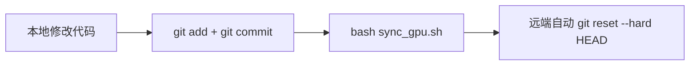

# AGENTS.md — MotionCanvas

## 工作环境

- **代码读写**：在本地 (`/home/qjming/MotionCanvas`) 进行。
- **远端运行环境**：autodl GPU 容器，通过 SSH Host `motion_canvas_gpu` 连接。
- **同步**：本地修改后用 `bash sync_gpu.sh` 推送 + 同步到远端工作区。
- **远端 Python**：`/root/MotionCanvas/.venv/bin/python`（没有 pip 模块，用 uv 管理）。
- **远端 Gradio 版本**：6.9.0（注意 API 兼容性）。

## Git 工作流（重要）



- **`sync_gpu.sh` 前必须先 git commit**：`sync_gpu.sh` 会推送本地 git 仓库到远端 remote `gpu`，远端执行 `git reset --hard HEAD`。**未提交的修改会被丢弃在远端**。
- 远端仓库设为 `receive.denyCurrentBranch = updateInstead`，推送后自动同步。
- 如果只需要传单个文件到远端调试，可用 `scp` 替代：
  ```bash
  scp apps/gradio/motioncanvas.py motion_canvas_gpu:/root/MotionCanvas/apps/gradio/
  ```

## 项目架构

```
apps/gradio/
  motioncanvas.py       # Gradio UI 主入口 (1972行)
  llm_assistant.py      # LLM 对话 + tool-calling + GDINO/SAM 定位 (2767行)
  entity_level_control.py # 实体级控制 painter
diffsynth/pipelines/
  wan_video_motioncanvas.py  # MotionCanvas 视频生成 pipeline
  tracker_utils.py           # CoTracker 轨迹追踪
inference_motioncanvas.py    # CLI 推理入口
evaluation/
  run_evaluation.py          # 单视频评估（质量评分 + 轨迹预览）
  evaluate_ablations.py      # 批量消融评估（汇总 CSV/JSON）
  trajectory_preview.py      # 轨迹预览渲染（bbox框 + 热力图）
  image_quality_metrics.py   # ImageReward/Aesthetic/PickScore 等质量模型
  reference_metrics.py       # SSIM/LPIPS/PSNR 参考指标
generate_trajectory_preview.py  # 独立的轨迹预览生成脚本
run_ablation.py              # 批量消融实验入口
```

## 核心关注文件

- `apps/gradio/motioncanvas.py` — Gradio UI、模型加载、视频生成、bbox/point/camera 编辑
- `apps/gradio/llm_assistant.py` — LLM 助手、GroundingDINO + SAM 定位、tool-calling
- `diffsynth/pipelines/wan_video_motioncanvas.py` — WanVideo 推理 pipeline
- `evaluation/trajectory_preview.py` — 轨迹预览视频渲染（从 bbox_mask.pt / track_video.pt）

## 关键概念

- **Bbox 关键帧**：ImageEditor 涂抹区域 → 归一化 bbox `[x1,y1,x2,y2]`（0-1），存储为 `{"0": [...], "5": [...]}`
- **Point 关键帧**：ImageEditor 点标记 → 归一化点列表 `[[x,y], ...]`
- **Camera 关键帧**：zoom/pan_x/pan_y/rotation 每帧参数
- **JSON 格式**：`{"objects": [{"frames": {"0": [x1,y1,x2,y2]}}]}`, `{"camera": {"keyframes": [...]}}`
- **LLM 模式**：优先 tool-calling（round-based），fallback 到 JSON updates/ops
- **canvas_size**：两个 ImageEditor 均为 (832, 480)，`image_mode="RGBA"`

## Gradio ImageEditor 输出格式

- **返回值**：`{"background": np.array, "layers": [np.array], "composite": np.array}`
- **设置值**：返回 numpy array 会被自动包装为 dict；为兼容 RGBA 模式，务必 `convert("RGBA")` 后缩放到 canvas_size 再返回
- **layers**：画笔/橡皮擦的笔迹存在 `layers[0]`（4 通道 RGBA），用 alpha 通道提取有效像素

## 开发命令

```bash
# ===== 消融实验 =====
# 运行批量消融（含 LLM 调用）
python run_ablation.py --config ablation_config.yaml --output_dir ./ablation_results

# 评估消融结果（质量评分）
python evaluation/evaluate_ablations.py --ablations_dir ./ablation_results --models ImageReward CLIP

# 生成轨迹预览视频（从已保存的 .pt 信号文件，纯 CPU）
python generate_trajectory_preview.py --dir ablation_results

# ===== 测试 =====
# 运行 test（仅限 llm_assistant 纯逻辑测试，无需 GPU）
.venv/bin/python -m pytest test/test_llm_chat.py -v

# 语法检查
.venv/bin/python -c "import py_compile; py_compile.compile('apps/gradio/llm_assistant.py', doraise=True)"
.venv/bin/python -c "import py_compile; py_compile.compile('apps/gradio/motioncanvas.py', doraise=True)"

# ===== 远端 =====
# 提交并同步到远端（必须先 git commit）
bash sync_gpu.sh

# 远端启动 Gradio app
ssh motion_canvas_gpu "cd /root/MotionCanvas && /root/MotionCanvas/.venv/bin/python apps/gradio/motioncanvas.py"
```

## 远端调试

```bash
# 直接 SSH 到远端执行 Python 检查
ssh motion_canvas_gpu "/root/MotionCanvas/.venv/bin/python -c 'import gradio; print(gradio.__version__)'"

# 检查远端文件内容
ssh motion_canvas_gpu "grep -A5 'def sync_image_to_editors' /root/MotionCanvas/apps/gradio/motioncanvas.py"

# scp 单文件同步（不用 git）— 适合快速调试
scp apps/gradio/motioncanvas.py motion_canvas_gpu:/root/MotionCanvas/apps/gradio/
```

## 重要陷阱

1. **transformers 5.x API 变更**：`post_process_grounded_object_detection` 参数名从 `box_threshold` 改为 `threshold`。
2. **Gradio 6.x ImageEditor**：设置 background 时必须确保 RGBA 4 通道，且大图应缩放到 canvas_size 防止浏览器卡死。
3. **multimask_output=True**：SAM 返回 3 个 mask（whole/part/subpart），`argmax(scores)` 会错选 subpart 导致点不准。应使用 `_score_sam_mask` 质量评分。
4. **模型路径约定**：所有模型在 `/root/autodl-tmp/models/`，通过 `MODEL_PATH_PREFIX` 变量统一管理。
5. **事件绑定参数**：`llm_apply_instruction` 有 28 个参数，所有调用点（`llm_send_btn.click`、`llm_user_msg.submit`）的 inputs 列表必须对齐。
6. **轨迹预览渲染**：`render_from_bbox_mask` 用 RGBA 叠加层 + `alpha_composite` 实现半透明，避免 `convert("RGB")` 直接丢 alpha 导致填充变黑实心。边框和填充分别画在不同的层上再合成。
