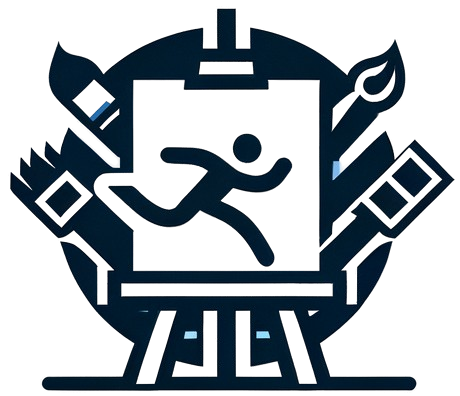

## ___***MotionCanvas: Cinematic Shot Design with Controllable Image-to-Video Generation***___
<div align="center">
</img>

 <a href='https://arxiv.org/abs/2502.04299'></a> &nbsp;
 <a href='https://motion-canvas25.github.io/'></a> &nbsp;

 _**[Jinbo Xing](https://doubiiu.github.io/), [Long Mai](https://mai-t-long.com/), [Cusuh Ham](https://cusuh.github.io/), [Jiahui Huang](https://gabriel-huang.github.io/), [Aniruddha Mahapatra](https://anime26398.github.io/), [Chi-Wing Fu](https://www.cse.cuhk.edu.hk/~cwfu/), [Tien-Tsin Wong](https://ttwong12.github.io/myself.html), [Feng Liu](https://pages.cs.wisc.edu/~fliu/)**_
<br><br>
CUHK & Adobe Research

<strong>SIGGRAPH 2025, Conference Proceedings</strong>

</div>

## 🔆 Introduction
🥺 This is a minimal re-implementation of MotionCanvas based on Wan-I2V-1.3B with limited resources.

🤗 MotionCanvas can generate short video clips from a static image with specified camera motion and object (global and local) motion. Please check our project page and paper for more information. <br>

## 📝 Changelog
- [ ] Add gradio demo and inference code for camera and object motion control.
- __[2025.07.26]__: Release the minimal re-implementation code.
- __[2025.02.26]__: Launch the project page and update the arXiv preprint.
<br>


## 🧰 Models

|Model|Resolution|GPU Mem. & Inference Time (A100, ddim 50steps)|Checkpoint|
|:---------|:---------|:--------|:--------|
|MotionCanvas|832x480| -|[Hugging Face]()|

Download the pre-trained [Wan2.1-Fun-1.3B-InP](https://modelscope.cn/models/PAI/Wan2.1-Fun-1.3B-InP) model weights and our pre-trained weights.
This re-implementation of MotionCanvas supports generating videos of up to 49 frames with a resolution of 832x480. The inference time can be reduced by using fewer denoising steps.


## ⚙️ Setup

### Install Environment via Anaconda (Recommended)
Please follow the instruction of installation in [DiffSynth-Studio](https://github.com/modelscope/DiffSynth-Studio/tree/main).


<!-- ## 💫 Inference
### 1. Command line

Download pretrained ToonCrafter_512 and put the `model.ckpt` in `checkpoints/tooncrafter_512_interp_v1/model.ckpt`.
```bash
  sh scripts/run.sh
```


### 2. Local Gradio demo

Download the pretrained model and put it in the corresponding directory according to the previous guidelines.
```bash
  python gradio_app.py  -->

## 😉 Citation
Please consider citing our paper if our code is useful:
```bib
@article{xing2025motioncanvas,
  title={Motioncanvas: Cinematic shot design with controllable image-to-video generation},
  author={Xing, Jinbo and Mai, Long and Ham, Cusuh and Huang, Jiahui and Mahapatra, Aniruddha and Fu, Chi-Wing and Wong, Tien-Tsin and Liu, Feng},
  journal={arXiv preprint arXiv:2502.04299},
  year={2025}
}
```

## 🙏 Acknowledgements
We would like to thank [Yujie](https://scholar.google.com/citations?user=grn93WcAAAAJ&hl=zh-CN) for providing partial implementation, [DiffSynth-Studio](https://github.com/modelscope/DiffSynth-Studio/tree/main) for offering an awesome codebase and [Wan-AI](https://github.com/Wan-Video/Wan2.1) for GPU support.

<a name="disc"></a>
## 📢 Disclaimer

This project strives to impact the domain of AI-driven video generation positively. Users are granted the freedom to create videos using this tool, but they are expected to comply with local laws and utilize it responsibly. The developers do not assume any responsibility for potential misuse by users.
****