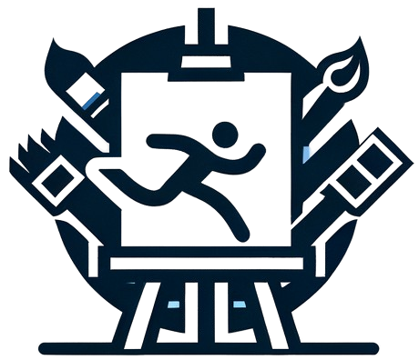

## ___***MotionCanvas: Cinematic Shot Design with Controllable Image-to-Video Generation***___
<div align="center">
</img>

 <a href='https://arxiv.org/abs/2502.04299'></a> &nbsp;
 <a href='https://motion-canvas25.github.io/'></a> &nbsp;
 <a href='https://github.com/Doubiiu/MotionCanvas'></a> &nbsp;

 _**[Jinbo Xing](https://doubiiu.github.io/), [Long Mai](https://mai-t-long.com/), [Cusuh Ham](https://cusuh.github.io/), [Jiahui Huang](https://gabriel-huang.github.io/), [Aniruddha Mahapatra](https://anime26398.github.io/), [Chi-Wing Fu](https://www.cse.cuhk.edu.hk/~cwfu/), [Tien-Tsin Wong](https://ttwong12.github.io/myself.html), [Feng Liu](https://pages.cs.wisc.edu/~fliu/)**_
<br><br>
CUHK & Adobe Research

<strong>SIGGRAPH 2025, Conference Proceedings</strong>

</div>

## 🔆 Introduction
🥺 This is a minimal re-implementation of MotionCanvas based on Wan-I2V-1.3B with limited resources.

🤗 MotionCanvas can generate short video clips from a static image with specified camera motion and object (global and local) motion. Please check our project page and paper for more information. <br>

## 📝 Changelog
- __[2025.07.26]__: Release the minimal re-implementation code.
- __[2025.02.26]__: Launch the project page and update the arXiv preprint.
<br>

## 🚀 项目增强（本项目修改部分）

在原版 MotionCanvas 基础上，本项目增加了以下功能和改进：

### Gradio 交互界面（`apps/gradio/`）

- **`motioncanvas.py`** (~2000行)：完整的 Gradio Web UI
  - 双 ImageEditor 画布（源图像 + 轨迹预览），支持 bbox 涂抹、point 点击、camera 参数编辑
  - 关键帧编辑器：在不同帧上设定不同 bbox/point，实现时序控制
  - 实时轨迹预览渲染
- **`llm_assistant.py`** (~2800行)：LLM 智能助手
  - 自然语言指令 → 自动定位目标并生成运动轨迹
  - 集成 **GroundingDINO**（开放词汇目标检测）+ **SAM**（目标分割）实现精确目标定位
  - Tool-calling 架构：支持 `gdino_detect_bbox` 和 `gdino_sam_detect_point` 两种定位工具
  - 支持 centroid / top_center 等多种 SAM 关键点策略
  - Round-based 对话流程，fallback 到 JSON updates/ops

### 轨迹与评估系统（`evaluation/`）

- **`trajectory_preview.py`**：从 bbox_mask.pt / track_video.pt 信号文件渲染轨迹预览视频（RGBA 半透明叠加层 + bbox 边框渲染）
- **`image_quality_metrics.py`**：多模型视频质量评分（ImageReward / Aesthetic / PickScore / CLIP / HPSv2 / MPS）
- **`reference_metrics.py`**：参考图像指标（SSIM / LPIPS / PSNR）
- **`evaluate_ablations.py`**：批量消融实验评估，汇总 CSV/JSON
- **`run_evaluation.py`**：单视频质量评分 + 轨迹预览

### 消融实验框架

- `run_ablation.py` + `ablation_config.yaml`：批量消融实验入口
- 支持 LLM 模式 vs 直接模式的对比实验
- `generate_trajectory_preview.py`：独立轨迹预览生成脚本（纯 CPU 可运行）

### 开发工具链

- `setup_from_zero.sh`：从零环境搭建脚本（uv + venv + 依赖 + 模型下载）
- `download_models.sh`：模型下载脚本（支持断点续传，自动跳过已下载文件）
- `sync_gpu.sh`：本地 → AutoDL GPU 容器代码同步（自动解析 SSH config）
- `experiment.sh`：一键运行完整消融实验流程

### 关键环境变量

| 变量 | 用途 | 默认值 |
|:------|:------|:------|
| `MODEL_PATH_PREFIX` | 模型根目录 | `/root/autodl-tmp/models` |
| `MOTIONCANVAS_GDINO_MODEL_ID` | GroundingDINO 模型 ID | `IDEA-Research/grounding-dino-base` |
| `MOTIONCANVAS_GDINO_DEVICE` | GDINO 推理设备 | `cuda` |
| `MOTIONCANVAS_SAM_CKPT` | SAM checkpoint 路径 | **必填** |
| `MOTIONCANVAS_SAM_TYPE` | SAM 模型类型 | `vit_h` |
| `MOTIONCANVAS_SAM_DEVICE` | SAM 推理设备 | `cuda` |

<br>


## 🧰 Models

|Model|Resolution|GPU Mem. & Inference Time (A100, ddim 50steps)|Checkpoint|
|:---------|:---------|:--------|:--------|
|MotionCanvas|832x480| -|[ModelScope](https://www.modelscope.cn/models/doubiiu/MotionCanvas/files)|

Download the pre-trained [Wan2.1-Fun-1.3B-InP](https://modelscope.cn/models/PAI/Wan2.1-Fun-1.3B-InP) model weights and our pre-trained weights.
This re-implementation of MotionCanvas supports generating videos of up to 49 frames with a resolution of 832x480. The inference time can be reduced by using fewer denoising steps.


## ⚙️ Setup

### 实际运行环境

本项目在以下环境中开发、测试与部署：

| 项目 | 说明 |
|:------|:------|
| **GPU 平台** | [AutoDL](https://www.autodl.com/) 容器实例 |
| **GPU 型号** | NVIDIA A100 / RTX 4090 |
| **操作系统** | Ubuntu 22.04 |
| **Python** | 3.10.8 |
| **包管理器** | [uv](https://docs.astral.sh/uv/)（无 pip 模块） |
| **虚拟环境** | `/root/MotionCanvas/.venv/` |
| **模型目录** | `/root/autodl-tmp/models/` |
| **关键包版本** | PyTorch 2.10.0 · Gradio 6.9.0 · Diffusers 0.37.0 · Transformers 5.3.0 |
| **版本锁** | `requirements-lock.txt`（完整的精确版本快照） |

### 一键从零搭建（推荐）

项目提供了 `setup_from_zero.sh` 脚本，可一键完成环境配置：

```bash
# 全流程：安装 uv → 创建 venv → 安装依赖 → 下载模型
bash setup_from_zero.sh

# 仅配置环境，不下载模型（模型可稍后手动下载）
bash setup_from_zero.sh --skip-models

# 指定 Python 版本
bash setup_from_zero.sh --python 3.10
```

脚本会自动完成以下步骤：
1. 安装 [uv](https://docs.astral.sh/uv/) 包管理器
2. 创建项目虚拟环境 `.venv`
3. 以可编辑模式安装项目依赖（`uv pip install -e .`）
4. 调用 `download_models.sh` 下载所需模型

### 手动配置

如果自动脚本出现问题，可以按以下步骤手动配置：

```bash
# 1. 安装 uv
curl -LsSf https://astral.sh/uv/install.sh | sh

# 2. 创建虚拟环境
uv venv --python 3.10
source .venv/bin/activate

# 3. 安装项目依赖（可编辑模式）
uv pip install -e .

# 4. ⚠️ 固定 setuptools 版本（重要）
# pyproject.toml 中 [build-system].requires 的版本约束仅作用于构建隔离环境，
# 不会限制 venv 中实际安装的 setuptools 版本，因此需要手动固定：
uv pip install setuptools==80.10.2

# 5. 下载模型
bash download_models.sh
```

#### 精确复现远端环境

如需 1:1 复现远端 `motion_canvas_gpu` 的完整环境（含所有传递依赖的精确版本）：

```bash
uv pip install -r requirements-lock.txt
```

> `requirements-lock.txt` 从远端实际环境导出，包含所有包的精确版本号。</ins>

### 模型下载

模型默认下载到 `/root/autodl-tmp/models/`（适配 AutoDL 容器环境）：

```bash
bash download_models.sh                    # 默认 ModelScope 下载
bash download_models.sh --model-dir /your/path  # 自定义目录
```

需下载的模型包括：

| 模型 | 大小 | 用途 |
|:------|:------|:------|
| Wan2.1-Fun-1.3B-InP | ~19GB | 基础视频生成模型 |
| Wan2.1-1.3B Motion Controller | ~数百MB | 运动控制 |
| VACE-Wan2.1-1.3B | ~数GB | 视频编辑 |
| MotionCanvas 预训练权重 | ~3.1GB | 项目核心权重 |
| GroundingDINO | ~数百MB | LLM 助手目标检测 |
| SAM (vit_h) | ~2.6GB | 目标分割 |
| CoTracker | ~数百MB | 轨迹追踪（torch.hub 缓存） |


#### 版本锁定

项目根目录的 `requirements-lock.txt` 保存了远端 GPU 环境的完整精确版本快照，可用于：

```bash
# 在新机器上 1:1 复现远端环境
uv pip install -r requirements-lock.txt

# 对比当前环境与锁文件的差异
uv pip install -r requirements-lock.txt --dry-run
```

### 运行

```bash
# 激活环境后启动 Gradio 界面
source .venv/bin/activate
python apps/gradio/motioncanvas.py

# 或使用 uv run（无需手动激活）
uv run python apps/gradio/motioncanvas.py
```

### 开发环境同步

本地开发 → 远端 GPU 的同步流程：

```bash
# 1. 本地修改代码
# 2. 提交修改
git add -A && git commit -m "your message"
# 3. 推送到远端 GPU（远端自动 git reset --hard 同步）
bash sync_gpu.sh
```

> **注意**：`sync_gpu.sh` 前必须先 git commit，否则未提交的修改会在远端被丢弃。


<!-- ## 💫 Inference
### 1. Command line

Download pretrained ToonCrafter_512 and put the `model.ckpt` in `checkpoints/tooncrafter_512_interp_v1/model.ckpt`.
```bash
  sh scripts/run.sh
```


### 2. Local Gradio demo

Download the pretrained model and put it in the corresponding directory according to the previous guidelines.
```bash
  python gradio_app.py  -->

## 😉 Citation
Please consider citing our paper if our code is useful:
```bib
@article{xing2025motioncanvas,
  title={Motioncanvas: Cinematic shot design with controllable image-to-video generation},
  author={Xing, Jinbo and Mai, Long and Ham, Cusuh and Huang, Jiahui and Mahapatra, Aniruddha and Fu, Chi-Wing and Wong, Tien-Tsin and Liu, Feng},
  journal={arXiv preprint arXiv:2502.04299},
  year={2025}
}
```

## 🙏 Acknowledgements
We would like to thank [Yujie](https://scholar.google.com/citations?user=grn93WcAAAAJ&hl=zh-CN) for providing partial implementation, [DiffSynth-Studio](https://github.com/modelscope/DiffSynth-Studio/tree/main) for offering an awesome codebase and [Wan-AI](https://github.com/Wan-Video/Wan2.1) for GPU support.

<a name="disc"></a>
## 📢 Disclaimer

This project strives to impact the domain of AI-driven video generation positively. Users are granted the freedom to create videos using this tool, but they are expected to comply with local laws and utilize it responsibly. The developers do not assume any responsibility for potential misuse by users.
****
